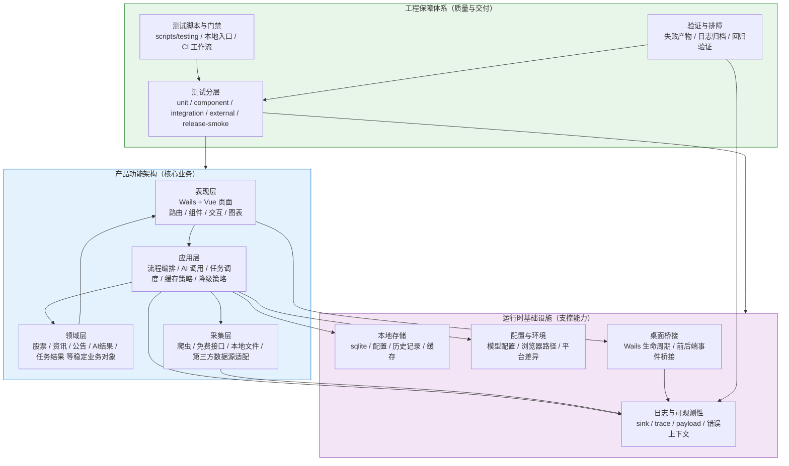
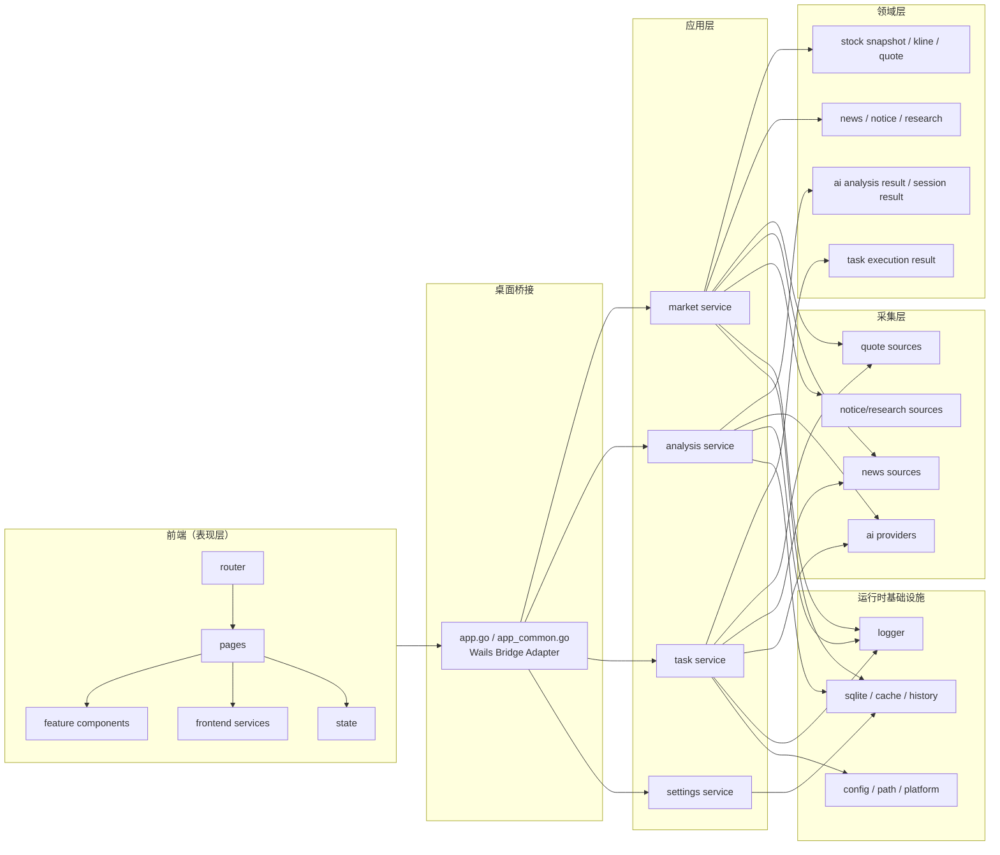

# go-stock 整体架构重构设计

## 1. 背景

当前仓库已经具备较完整的股票分析、市场资讯、AI 分析、AI 助手、定时任务和桌面桥接能力，但整体结构已经出现明显的自然生长痕迹，主要表现为：

- [app.go](D:/codex_work/go-stock/app.go) 当前约 2110 行，同时承担 Wails 桥接、应用编排、任务控制、预警通知和部分运行时逻辑，职责过厚。
- [backend/data](D:/codex_work/go-stock/backend/data) 当前包含 78 个 Go 文件，混杂了数据源适配、AI API、提示词、情感分析、工具函数、设置与部分业务逻辑，已经成为默认杂物层。
- 前端当前以 [frontend/src/components](D:/codex_work/go-stock/frontend/src/components) 为主，约 40 个文件；[frontend/src/router/router.js](D:/codex_work/go-stock/frontend/src/router/router.js) 直接将路由指向重量级组件，页面、组件、服务边界不清。
- 前端依赖同时使用 `naive-ui` 与 `@tdesign-vue-next/chat`，缺少清晰的 UI 主体系与特例边界。
- 项目数据源现实是“免费优先、爬虫优先、稳定性有限”，这决定了架构必须接受外部源不稳定，而不是假设单一数据源长期可靠。
- 当前正在推进的日志统一与测试分层工作，已经为整体重构提供了正确的底座方向：先补可观测性与质量门禁，再做结构性调整。

因此，这次需求不应理解为“整理几个目录”或“顺手拆几个文件”，而应理解为：为 `go-stock` 建立长期可维护的整体架构边界，使核心业务、运行时基础设施与工程保障体系彼此清晰，并为后续分阶段迁移提供统一坐标系。

## 2. 已确认约束

本次设计阶段已确认以下前提：

- 项目定位为开源免费主产品，不再恢复收费功能，也不以商业化功能解锁为当前目标。
- 项目的主要价值是作者自用、学习 AI 能力、练习架构与设计能力，同时开放给社区使用。
- 长期成本目标是尽量接近零成本；AI 推理由用户自带 API Key 或本地模型承担，项目本身不承担持续推理成本。
- 股票、资讯、公告等数据优先依赖免费接口、爬虫与本地缓存；无确切信息表明存在一个足够稳定且零成本的统一数据源，因此架构必须接受“多源、可降级、可替换”。
- 本次重构聚焦整体架构，不更换 `Go + Wails + Vue` 技术栈。
- 本次重构包含表现层统一，但不包含整套品牌级视觉重设计。
- 当前日志统一与测试分层工作属于整体架构重构的前置底座，不是独立支线。

## 3. 目标

本次整体架构重构需要同时达成以下目标：

- 为项目建立统一的三大板块视角：
  - 产品功能架构
  - 运行时基础设施
  - 工程保障体系
- 在产品功能架构内部明确四层职责：
  - 表现层
  - 应用层
  - 领域层
  - 采集层
- 建立稳定的前后端契约，避免页面直接感知某个具体数据源或爬虫实现。
- 逐步将 [app.go](D:/codex_work/go-stock/app.go) 收敛为桥接适配层，而不是继续承担复杂业务编排。
- 逐步停止 [backend/data](D:/codex_work/go-stock/backend/data) 的继续膨胀，并引入更清晰的 `source` / `service` 边界。
- 在前端建立统一的页面壳、服务层与组件边界，停止“路由直接挂重量级组件”的自然生长模式。
- 让日志、错误模型和测试分层成为整体重构的安全网，支撑每一个迁移阶段的验证与排障。

## 4. 非目标

以下内容不在本次整体架构重构范围内：

- 不更换 Wails、Vue 或 Vite。
- 不将当前桌面产品改造成云端托管服务。
- 不做整套 UI 视觉重设计，不以品牌升级或全量页面重画为第一阶段目标。
- 不一次性重写全部数据源适配。
- 不优先重写 AI 助手的复杂多轮 Agent 体系。
- 不先拆 [backend/models/models.go](D:/codex_work/go-stock/backend/models/models.go) 成多个细粒度包。
- 不进行大规模数据库结构迁移或全量历史数据重整。
- 不为了未来可能的商业化预留大量当前用不到的抽象。

## 5. 总体架构图

这张图表达的核心含义如下：

- 产品功能架构回答“功能怎么工作”。
- 运行时基础设施回答“系统靠什么稳定运行、可配置、可观测”。
- 工程保障体系回答“系统如何被验证、门禁与排障”。
- 在核心业务内部：
  - `SOURCE` 负责拿原始数据或半结构化结果。
  - `APP` 负责编排、降级、缓存、聚合与映射。
  - `DOMAIN` 代表稳定业务语义，不直接依赖具体爬虫或第三方源。
  - `UI` 只消费稳定输出，不接触源细节。

## 6. 当前项目映射

### 6.1 产品功能架构

- 表现层
  - [frontend/src/router/router.js](D:/codex_work/go-stock/frontend/src/router/router.js)
  - [frontend/src/components](D:/codex_work/go-stock/frontend/src/components)
- 应用层
  - [app.go](D:/codex_work/go-stock/app.go)
  - [app_common.go](D:/codex_work/go-stock/app_common.go)
  - [backend/agent](D:/codex_work/go-stock/backend/agent)
- 领域层
  - [backend/models/models.go](D:/codex_work/go-stock/backend/models/models.go)
  - 以及散落在 [backend/data](D:/codex_work/go-stock/backend/data) 中的部分业务结果结构
- 采集层
  - [backend/data](D:/codex_work/go-stock/backend/data) 中的各类爬虫、行情、资讯、公告、AI provider 与外部接口适配

### 6.2 运行时基础设施

- 日志与可观测性
  - [backend/logger](D:/codex_work/go-stock/backend/logger)
- 本地存储
  - [backend/db](D:/codex_work/go-stock/backend/db)
  - [data](D:/codex_work/go-stock/data)
- 配置与环境
  - [backend/apppath](D:/codex_work/go-stock/backend/apppath)
  - [wails.json](D:/codex_work/go-stock/wails.json)
- 桌面桥接
  - [app.go](D:/codex_work/go-stock/app.go)
  - [app_common.go](D:/codex_work/go-stock/app_common.go)

### 6.3 工程保障体系

- 设计与计划文档
  - [docs/superpowers/specs/2026-04-05-test-layering-and-log-unification-design.md](D:/codex_work/go-stock/docs/superpowers/specs/2026-04-05-test-layering-and-log-unification-design.md)
  - [docs/superpowers/plans/2026-04-05-test-layering-and-log-unification.md](D:/codex_work/go-stock/docs/superpowers/plans/2026-04-05-test-layering-and-log-unification.md)
- 包级测试
  - [app_test.go](D:/codex_work/go-stock/app_test.go)
  - [backend/logger/core_test.go](D:/codex_work/go-stock/backend/logger/core_test.go)
  - 以及各包 `_test.go`
- 后续测试运行时与门禁入口
  - `internal/testenv`
  - `scripts/testing`
  - GitHub Actions workflows

## 7. 目标模块边界

### 7.1 后端目标边界

第一阶段不大规模重命名现有包，而是引入两个最小但明确的新边界：

- `backend/source`
  - 只负责不稳定外部来源适配
  - 包括：爬虫、免费接口、AI provider、公告/资讯/行情/研究报告等来源
- `backend/service`
  - 只负责稳定业务用例编排
  - 包括：聚合、缓存、降级、结果映射、稳定输出结构

已有包的目标定位如下：

- [backend/logger](D:/codex_work/go-stock/backend/logger)：运行时基础设施，继续作为统一日志门面
- [backend/db](D:/codex_work/go-stock/backend/db)：运行时基础设施，负责本地数据库与访问
- [backend/apppath](D:/codex_work/go-stock/backend/apppath)：运行时基础设施，负责路径与环境差异
- [backend/models](D:/codex_work/go-stock/backend/models/models.go)：阶段性保留为稳定结构承载，不在第一阶段细拆
- [backend/agent](D:/codex_work/go-stock/backend/agent)：保留为应用层的一部分，优先不大改
- [app.go](D:/codex_work/go-stock/app.go)：逐步收敛为 Wails Bridge Adapter，只负责调用 service

### 7.2 前端目标边界

前端第一阶段建立以下结构，而不是直接重写所有页面：

- `frontend/src/pages`
  - 路由页面，只负责页面组织与组装
- `frontend/src/components/shared`
  - 通用展示组件
- `frontend/src/components/<feature>`
  - 功能专用组件
- `frontend/src/services`
  - 所有 Wails/后端调用入口
- `frontend/src/state`
  - 少量跨页共享状态

前端固定采用以下调用路径：

- `router -> pages`
- `pages -> feature components`
- `pages -> services`
- 深层组件不直接调 Wails API

### 7.3 目标边界图

## 8. 表现层统一策略

本次整体重构包含表现层统一，但不包含全量视觉重设计。表现层统一的目标是让前端“像一个产品”，而不是继续自然长成若干大页面组件。

### 8.1 需要统一的内容

- 页面骨架
  - 左侧导航
  - 顶部操作区
  - 主内容区
  - 辅助信息区
- 页面组织
  - 页面负责组装
  - 组件负责展示
  - 服务层负责调后端
- 视觉规则
  - 间距
  - 圆角
  - 字号层级
  - 颜色语义
  - 卡片 / 表格 / 空状态 / 错误状态 / 加载状态
- 交互习惯
  - 筛选区布局
  - 详情弹层
  - 图表工具区
  - 列表与详情切换方式

### 8.2 UI 体系约束

- `naive-ui` 作为通用页面基础组件主体系。
- `@tdesign-vue-next/chat` 仅保留为 AI 助手场景的局部特例，不再横向扩展为全局 UI 主体系。
- 不再引入第三套大型 UI 组件体系。

### 8.3 第一阶段表现层目标

- 新建 `pages` 和 `services` 目录并实际承接新链路。
- 选 1 到 2 个高频只读页面作为统一样板页。
- 不在第一阶段追求全量页面重画或品牌视觉升级。

## 9. 稳定契约与错误模型

### 9.1 第一批稳定契约

第一阶段先定义五类稳定输出，不追求一次覆盖全部功能：

- `StockSnapshot`
- `KLineResult`
- `NewsFeedResult`
- `AIAnalysisResult`
- `TaskExecutionResult`

这些结构的职责是：

- 隔离前端与具体数据源字段
- 作为 service 向 bridge 与前端输出的稳定契约
- 为后续测试和回归提供明确断言对象

### 9.2 错误处理模型

错误按层分为四类：

- `SourceError`
  - 外部数据源、爬虫、第三方接口、浏览器抓取失败
- `ServiceError`
  - 聚合、缓存、映射、降级决策失败
- `BridgeError`
  - 前后端桥接参数、调用与事件传递失败
- `UserVisibleError`
  - 最终暴露给前端展示的稳定错误模型

面向前端的统一错误结构至少包含：

- `code`
- `message`
- `retryable`
- `stage`

其中 `stage` 取值固定为：

- `source`
- `service`
- `bridge`

## 10. 日志与可观测性策略

日志是跨层基础设施，但只在边界和关键链路上承担观测职责，不替代业务断言。

### 10.1 各层日志职责

- `source` 层
  - 记录 provider 调用、重试、降级、字段解析失败、页面结构变化、超时与限流
- `service` 层
  - 记录编排结果、缓存命中、降级决策、聚合结果摘要
- `bridge` 层
  - 记录前后端请求入口、参数摘要、响应结果、前端异常回传
- `UI` 层
  - 仅保留开发调试信息；前端运行时错误应回传后端统一链路

### 10.2 统一字段与事件名

继续沿用并强化当前已有字段语义：

- `trace_id`
- `span_id`
- `app_session_id`
- `source`

逐步补齐关键上下文字段：

- `provider`
- `resource`
- `stock_code`
- `market`
- `task_name`
- `status_code`
- `cache_hit`
- `fallback_used`

事件名统一采用：

- `<domain>.<action>.<result>`

例如：

- `market.fetch.failed`
- `kline.provider.fallback`
- `task.execute.completed`
- `frontend.error`
- `bridge.request.failed`

## 11. 测试与验证策略

测试分层是整体架构重构的安全网，不是附属工程。

### 11.1 固定测试层次

- `unit`
  - 纯映射、纯规则、纯转换、fallback 决策、错误翻译
- `component`
  - logger、db、bridge、service 边界、缓存行为、契约输出
- `integration`
  - 关键只读链路，例如市场页、K 线、资讯聚合
- `external`
  - 真实 provider、真实爬虫、真实 AI、真实行情与公告源
- `release-smoke`
  - Wails 生命周期、桌面桥接、系统提醒、关键页面可运行性

### 11.2 日志与测试的关系

- 普通业务正确性仍以断言为主。
- 日志作为链路证据和排障证据。
- 每一阶段迁移，都必须至少补齐对应链路的 `component` 或 `integration` 验证。
- 每个新增 `source` 适配，至少保留 `external` 级验证入口。

### 11.3 第一批优先保护链路

- 市场资讯链路
- K 线链路
- AI 分析链路
- 定时任务链路

## 12. 分阶段迁移策略

### 12.1 阶段 0：收稳底座

目标：

- 完成日志统一与测试分层重构。
- 形成统一测试入口、门禁、失败产物归档与 logger runtime。
- 建立整体重构前的安全网。

进入条件：

- 当前 `dev` 分支功能行为基本稳定。
- 日志统一与测试分层已经被确认是当前优先级最高的底座任务。

本阶段范围：

- `backend/logger`
- 测试 gate、`internal/testenv`、`scripts/testing`
- CI 中的默认 / external / release-smoke 门禁

完成标准：

- 默认测试门禁持续通过。
- `external` 与 `release-smoke` 具备独立入口。
- 关键链路失败时可通过统一日志与测试产物定位。
- 仓库规则明确落地：
  - 不再往 [backend/data](D:/codex_work/go-stock/backend/data) 根目录继续新增同类功能。
  - 不再在 [app.go](D:/codex_work/go-stock/app.go) 中新增复杂业务编排。
  - 深层前端组件不直接调用 Wails API。

测试重点：

- `component`
- `integration`
- logger 相关 `closeout` / `trace` / payload 验证

暂不处理：

- 业务链路的大规模搬迁
- 页面结构调整

### 12.2 阶段 1：建立新边界

目标：

- 建立 `backend/source`
- 建立 `backend/service`
- 建立 `frontend/src/pages`
- 建立 `frontend/src/services`
- 定义第一批稳定契约

进入条件：

- 阶段 0 已完成，基础日志与测试底座可用。
- 团队对总架构图和目标边界无异议。

本阶段范围：

- 新目录、新包和新调用约束建立
- 第一批稳定契约定义
- 前端页面壳与服务层目录落地

完成标准：

- 新边界目录已建立，并开始承接真实链路。
- 至少一组稳定契约被定义并实际用于新路径。
- 前端已存在 `pages` 和 `services`，且至少有一个新页面壳通过该结构组织。
- 新功能默认优先进入 `source / service / pages / services` 路径，而不是旧杂物层。

测试重点：

- `unit`：契约映射、错误翻译、fallback 决策
- `component`：service 输出与 bridge 调用边界

暂不处理：

- 全量页面迁移
- 全量 provider 迁移
- AI 助手与任务系统重写

### 12.3 阶段 2：迁移第一条只读链路

优先链路：

- 市场行情
- 个股快照
- K 线
- 市场资讯
- 公告 / 研报摘要

进入条件：

- 阶段 1 的 `source / service / pages / services` 新边界已可承接真实代码。
- 第一批稳定契约已可表达市场与只读数据链路。

本阶段范围：

- 至少一条完整的只读业务链路按新边界迁移。
- 对应前端页面进入 `router -> pages -> feature components -> services` 新路径。
- 对应后端路径进入 `bridge -> service -> source` 新路径。

完成标准：

- 至少 1 条只读市场链路完成 `source -> service -> bridge -> frontend services -> pages` 迁移。
- 迁移后的页面不再直接依赖旧的重量级组件直连逻辑。
- 对应真实数据源仍可通过 `external` 验证。
- 对应失败可通过日志定位到 `source / service / bridge` 其中一层。

测试重点：

- `integration`：市场页、K 线、资讯聚合
- `external`：真实行情与资讯 provider
- `component`：service 聚合与 cache/fallback 行为

暂不处理：

- AI 助手多轮对话
- 定时任务和预警副作用
- 全量页面统一重画

### 12.4 阶段 3：迁移 AI 分析链路

优先迁移：

- AI 分析请求
- AI 结果存储 / 读取
- 提示词模板选择
- 历史分析结果查看

进入条件：

- 阶段 2 已证明新边界可承接真实只读链路。
- AI provider 的配置、日志与错误模型已具备统一承载能力。

本阶段范围：

- 以“分析型 AI”链路为主，不先碰“交互型 AI 助手”。
- 让 AI 分析结果走稳定契约与 service 输出。

完成标准：

- AI 分析请求不再由旧混合路径直接拼接 provider 结果给前端。
- AI 分析结果具备稳定结构、统一错误模型与统一日志上下文。
- 历史分析结果读取路径与新 service 边界一致。
- 对应 provider 至少保留 `external` 或受控集成验证入口。

测试重点：

- `component`：analysis service、结果映射、错误翻译
- `integration`：AI 分析请求到结果展示主链路
- `external`：真实 AI provider 或显式受控 provider 验证

暂不处理：

- AI 助手多轮实时聊天
- 复杂 Agent tool orchestration
- 社区/分享等外围功能重做

### 12.5 阶段 4：迁移任务、预警与设置

包括：

- Cron 任务
- 价格预警
- 系统通知
- AI 定时分析
- 设置与配置

进入条件：

- 阶段 2 和阶段 3 的核心读链路与分析链路已经稳定。
- 日志与错误模型已足够支撑跨层副作用排障。

本阶段范围：

- 将副作用较强的调度与通知链路纳入 `service` 边界。
- 让设置读取、任务执行、预警触发、系统通知有清晰职责分工。

完成标准：

- 任务执行链路可明确划分为 `task service -> source/provider -> db/logger/notification`。
- 预警与通知逻辑不再散落在多处桥接或页面调用中。
- 设置项读取与保存具备稳定边界，不再以页面直连业务实现为主。
- 关键任务失败时，日志可明确定位执行阶段、资源对象与失败原因。

测试重点：

- `component`：task service、settings service、notification adapter
- `integration`：cron -> execute -> persist/log closeout
- `release-smoke`：系统通知、桌面运行态相关链路

暂不处理：

- 全量历史任务配置迁移优化
- 非关键功能页的 UI 细节统一

### 12.6 阶段 5：清理旧路径

包括：

- 收缩 [backend/data](D:/codex_work/go-stock/backend/data) 中已被替代的职责
- 收缩 [app.go](D:/codex_work/go-stock/app.go) 到桥接职责
- 将前端路由逐步迁移到 `pages`
- 清理历史兼容壳与双轨路径

进入条件：

- 阶段 2 到阶段 4 的新路径已经覆盖关键链路。
- 新旧路径并行期间未发现无法接受的功能缺失。

本阶段范围：

- 删除或收缩旧实现入口。
- 明确标记仍保留的兼容层，并限制其继续扩展。

完成标准：

- [backend/data](D:/codex_work/go-stock/backend/data) 不再承担默认杂物层职责。
- [app.go](D:/codex_work/go-stock/app.go) 以桥接适配为主，不再作为新的业务编排入口。
- 前端主要页面路由已迁移到 `pages`。
- 旧兼容路径有清晰保留理由；无理由者被移除。

测试重点：

- 全仓 `default` 门禁
- 关键链路 `integration`
- 关键 provider `external`
- 关键桌面能力 `release-smoke`

暂不处理：

- 与本次重构无关的视觉翻新
- 纯属“更优雅”的额外抽象重写

## 13. 分阶段验收矩阵

### 13.1 阶段 0 验收

- 日志统一与测试分层设计已落实到代码与脚本。
- 失败链路能通过统一日志与测试产物排查。

### 13.2 阶段 1 验收

- 新边界目录存在且承接真实代码。
- 第一批稳定契约已经定义并被新路径使用。

### 13.3 阶段 2 验收

- 市场 / 只读链路中至少一条完整走新路径。
- 迁移页面具备新页面壳、新服务调用边界和对应测试证明。

### 13.4 阶段 3 验收

- AI 分析主链路完成新边界迁移。
- AI 结果读写、错误模型和日志链路统一。

### 13.5 阶段 4 验收

- 任务、预警、设置具备清晰服务边界。
- 副作用链路具备可验证、可排障的统一路径。

### 13.6 阶段 5 验收

- 旧路径被系统性收缩，而不是继续双轨共存。
- 核心页面、核心链路和核心 provider 均已纳入新边界体系。

## 14. 风险与回滚策略

已知风险：

- 免费数据源与爬虫天然不稳定，字段、页面结构和限流策略可能频繁变化。
- 过渡阶段存在新旧路径并存，容易出现双轨逻辑。
- 前后端契约重构时，最容易发生“页面能打开但字段语义悄悄漂移”的回归。
- 若过早重写 AI 助手与任务系统，复杂度会失控。

回滚策略：

- 每阶段都保留旧路径兜底一段时间，不做一次性大爆炸替换。
- 每阶段迁移必须以 `component` / `integration` 证明为前提。
- 每条关键链路在迁移前后都保持统一日志链路，便于失败时快速回退定位。

## 15. 结论

`go-stock` 当前最需要的不是换技术栈，也不是全面重画 UI，而是建立清晰的整体架构边界。

本次整体架构重构的原则是：

- 先明确三大板块：产品功能架构、运行时基础设施、工程保障体系
- 再明确核心业务四层：表现层、应用层、领域层、采集层
- 先做边界和契约，再做链路迁移
- 让日志统一与测试分层成为整体重构的前置安全网
- 在不更换现有技术栈的前提下，逐步把仓库从自然生长状态收敛为可长期维护的桌面研究工作台架构
